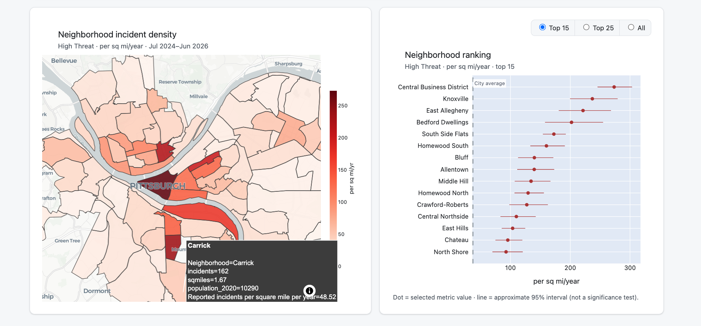
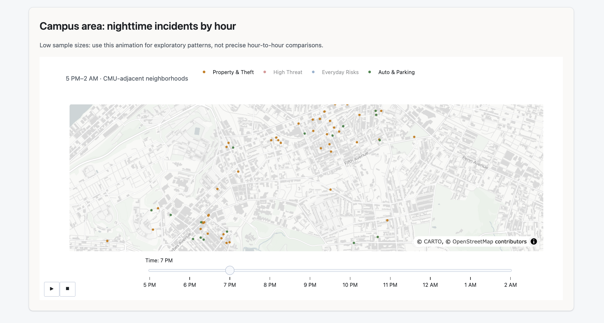
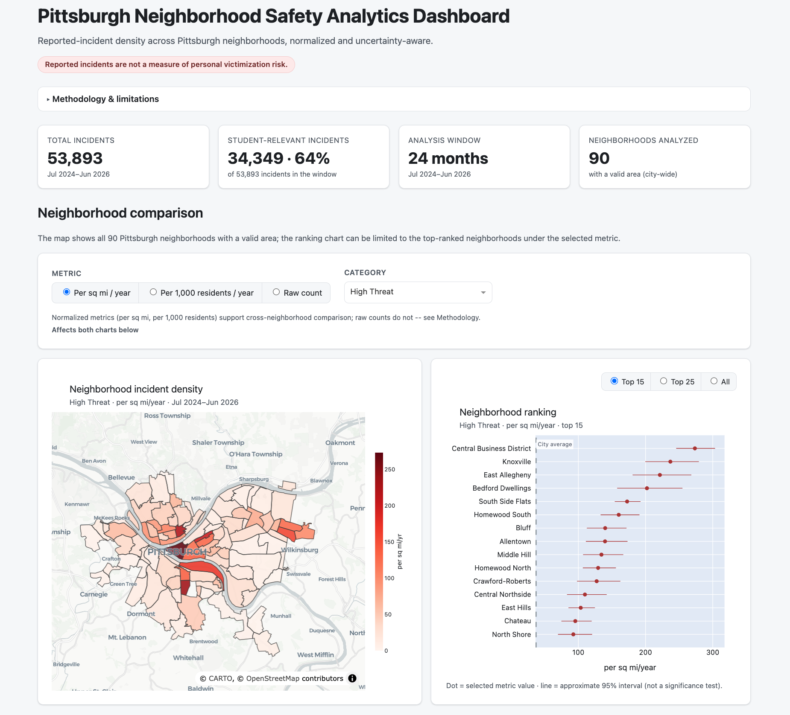

# Pittsburgh Neighborhood Safety Analytics Dashboard

An interactive [Dash](https://dash.plotly.com/) app, built with a CMU-student
lens on campus-area awareness and housing decisions, that visualizes
**reported police incidents** in Pittsburgh, regrouped into a heuristic,
student-oriented set of categories, and normalized into comparable rates
across every Pittsburgh neighborhood.

The broader "safety analytics" framing describes the product's purpose:
supporting safety-related decisions like housing and campus-area awareness.
The dashboard's actual outputs are always described in precise terms:
**reported incidents**, **reported incident density**, **reported incidents
per square mile per year**. It does not estimate personal victimization risk
(see below).

> **What this is:** a descriptive visualization of reported-incident density
> (where incidents were reported, normalized by area and, secondarily, by
> residential population), built to support practical decisions like housing
> and campus-area awareness.
>
> **What this is not:** a prediction of crime, a measure of personal risk or
> the probability that any individual will be a victim, an exposure-adjusted
> risk score, or an official crime-severity classification. See
> [Limitations](#limitations) before drawing conclusions from it.

## What it does

- Pulls all records from the City of Pittsburgh's police blotter dataset via
  the [WPRDC](https://data.wprdc.org/) open-data API, over a fixed 24-month
  window (2024-07-01 to 2026-06-30).
- Deduplicates offense-level records to unique incidents (`Report_Number`)
  and regroups them into four custom, student-oriented, **overlapping**
  categories: `High Threat`, `Property & Theft`, `Everyday Risks`, and
  `Auto & Parking`, plus an `All student-relevant incidents` view that
  deduplicates across all four.
- Renders, for every Pittsburgh neighborhood with a valid area:
  1. **A choropleth** of reported-incident density, switchable between three
     metrics (per square mile/year, per 1,000 residents/year, or raw count)
     and the five category views above.
  2. **A ranking chart** of the same neighborhoods with approximate
     uncertainty bars and a city-wide reference line.

     

  3. **A campus-area nighttime scatter map** (CMU-adjacent neighborhoods,
     5pm-2am), the one view still scoped to campus rather than the whole city.

     
- Publishes a **coverage audit** (in-app and in
  [`docs/category_coverage.md`](docs/category_coverage.md)) reconciling every
  incident in the window to exactly one status: student-relevant, out of
  scope, or administrative.

## Screenshots



## Data source

- **Incidents:** [Pittsburgh Police Blotter (Reported Crime Data)](https://data.wprdc.org/),
  resource ID `bd41992a-987a-4cca-8798-fbe1cd946b07`, queried via the
  `datastore_search` API action.
- **Neighborhood boundaries and area:** Pittsburgh neighborhood GeoJSON
  (also hosted on WPRDC), which carries a `sqmiles` field per neighborhood.
- **Neighborhood population:** [City of Pittsburgh Neighborhood Population 2020](https://data.wprdc.org/),
  resource ID `a8414ed5-c50f-417e-bb67-82b734660da6` (2020 Census).

All three sources are fetched live over HTTP each time the app starts; there
is no local copy or cache of the data in this repository.

## Architecture / workflow

The code is split into four modules under `pittsburgh-crime-dashboard/`,
each with one responsibility. No classes, no framework beyond Dash/Plotly:
kept as simple as the problem allows.

```
data.py       fetching, cleaning, offense taxonomy, incident modeling
analysis.py   coverage audit, normalized rates, uncertainty intervals, baselines
figures.py    Plotly figure builders
app.py        Dash layout, callbacks, main() entrypoint
```

```
fetch_crime_data()
  -> validate_required_columns()          -- fail fast if the schema changes
  -> drop_records_without_report_number() -- can't be attributed to an incident
  -> normalize_offense_codes()            -- fix known truncated/null offense codes
  -> filter_analysis_window()             -- fixed 2024-07-01..2026-06-30 window
  -> preprocess_crime_data()              -- parse timestamps, coerce coordinates
  -> build_incident_table()               -- one row per Report_Number
  -> build_incident_category_bridge()     -- one row per (Report_Number, category)
  -> compute_incident_coverage_status()   -- one mutually exclusive status per incident

fetch_neighborhood_geojson() -> extract_neighborhood_areas()
fetch_neighborhood_population()

compute_full_rate_table()  -- per category: counts, all 3 metrics, intervals, baselines
  -> build_choropleth_figure()
  -> build_ranking_figure()

build_campus_nighttime_offenses() -> build_campus_scatter_figure()

build_dash_app()   -- layout + metric/category selector callback
main()             -- runs the pipeline above, then app.run()
```

Network requests only happen inside `main()`/`load_and_prepare_data()`;
importing any module does not trigger HTTP calls, which keeps everything
testable.

## Setup

macOS / Linux:

```bash
python3 -m venv .venv
source .venv/bin/activate
pip install -r requirements.txt
```

Windows:

```bash
py -m venv .venv
.venv\Scripts\activate
pip install -r requirements.txt
```

## Running the app

```bash
cd pittsburgh-crime-dashboard
python app.py
```

Then open http://127.0.0.1:8053 in a browser. Startup takes roughly 20-30
seconds while the full incident dataset is downloaded and processed.

## Running the tests

```bash
pip install -r requirements-dev.txt
pytest
```

Tests cover the pure data-transformation and analysis logic (offense
normalization, taxonomy structure, incident deduplication, coverage status,
rate computation, Poisson intervals, city baselines) plus the API-fetching
functions with `requests` mocked; no test depends on the live API.

## Regenerating the coverage report

```bash
python scripts/generate_coverage_report.py
```

Fetches live data and rewrites `docs/category_coverage.md`.

## Methodology

### Incident model

Raw records are **offenses**, not incidents: a single police report
(`Report_Number`) can list multiple offense codes (about 27% of in-window
reports do). Every analysis in this dashboard counts unique incidents, not
offense rows.

- **Canonical incident record:** the earliest-reported offense row for each
  `Report_Number` (ties broken by the lowest internal record ID). This is
  when the underlying record shows a small number of same-`Report_Number`
  rows disagree on neighborhood, date, or coordinates (well under 1% of
  multi-row incidents), almost always a legitimate supplemental report
  (e.g. an assault later updated to a homicide, or a stolen vehicle logged
  as recovered elsewhere), not a data error.
- **Coordinates:** taken from the canonical row if present; otherwise from
  the earliest later row for the same `Report_Number` **that shares the
  canonical row's neighborhood**; otherwise left missing. Coordinates are
  never pulled from a row in a different neighborhood, since that would
  silently relocate the incident.
- **Two records with no `Report_Number` at all** (out of 101,562 raw rows)
  are dropped outright: they cannot be attributed to any incident.

### Category membership is overlapping, by design

An incident with both a burglary and an assault offense legitimately belongs
to two categories. This dashboard does **not** force each incident into one
dominant category. Concretely:

- The **incident table** (`build_incident_table`) has exactly one row per
  `Report_Number`: the overall incident count.
- The **incident-category bridge** (`build_incident_category_bridge`) has
  one row per `(Report_Number, category)` for every category the incident's
  offenses touch.
- **Category-specific totals do not sum to the overall total**, and are not
  expected to. An `"All student-relevant incidents"` view is provided
  separately, deduplicating across categories.
- Because categories share incidents, **their uncertainty intervals are not
  independent** and should not be combined or differenced across categories.

### Student-oriented taxonomy (heuristic, not an official classification)

Four categories, keyed on `NIBRS_Offense_Code` (a cleaner join key than the
free-text offense description: 58 distinct codes, a handful of known
truncated/blank variants fixed in `normalize_offense_codes`):

| Category | Offense codes |
|---|---|
| **High Threat** | murder/manslaughter, forcible sex offenses, kidnapping, robbery, aggravated assault, weapons violations |
| **Property & Theft** | burglary, theft from buildings, vandalism, arson, all other larceny, extortion |
| **Everyday Risks** | simple assault, intimidation, pocket picking/purse snatching, disorderly conduct, drunkenness, trespass |
| **Auto & Parking** | motor vehicle theft, theft from vehicle, theft of vehicle parts |

This is a manually authored regrouping reflecting what a student might
reasonably care about. It is **not** a NIBRS severity classification and has
not been validated against any external standard. Two things worth knowing
about it:

- **Aggravated assault is in `High Threat`**, not `Everyday Risks`: it is
  a Part I violent felony, not a minor offense.
- **`23H All Other Larceny` is in `Property & Theft`.** This is a broad
  NIBRS catch-all category (bicycle theft, package theft, and many other
  larceny types), not specifically residential/burglary-related; it is
  grouped here because it is theft, not because every instance touches
  housing decisions specifically.

### Exclusions: two different reasons, not one "Other" bucket

Records outside the four categories fall into two **distinct** buckets,
since conflating them would misrepresent real crime as noise:

- **Administrative / unresolvable** (`EXCLUDED_ADMINISTRATIVE_CODES`):
  `9999` (a non-NIBRS vehicle-offense administrative code), `90Z` ("All
  Other Offenses", uninterpretable), and any offense code with no
  resolvable value. These are not valid crime observations.
- **Out of scope** (`OUT_OF_SCOPE_CODES`): drug/narcotic offenses, vice,
  fraud/financial crimes, shoplifting, and several other Group B offenses.
  **These are real, validly reported offenses**: they are excluded only
  because they fall outside this product's student-safety question, not
  because they didn't happen.

Every incident in the analysis window gets exactly one mutually exclusive
**coverage status**: `student_relevant`, `out_of_scope`, or
`administrative`, based on the highest-priority offense it contains (an
incident with any student-relevant offense is `student_relevant`, even if
it also has an out-of-scope offense). This status is used only for the
coverage audit; it does not affect or restrict the (overlapping)
category-specific analyses above. See
[`docs/category_coverage.md`](docs/category_coverage.md) for the full,
regeneratable breakdown.

### Fixed analysis window

All rates use a fixed 24-month window, **2024-07-01 to 2026-06-30**, chosen
because it is the longest complete-month range available with no partial
months at either end. It is fixed rather than "most recent 24 months" so
results are reproducible across runs; revisit it manually as more data
accumulates.

### Denominators: area (primary) vs. population (secondary)

- **Area-normalized ("reported incidents per square mile per year") is the
  primary metric.** The denominator (each neighborhood's `sqmiles`, from the
  GeoJSON) is directly observed and sidesteps the specific residential-
  population problem described below (no undercounting of daytime/transient
  presence). But area is **not an exposure denominator**: it does not
  adjust for foot traffic, land use, how many people actually spend time in
  a neighborhood, or how walkable/drivable it is. A small, low-traffic
  neighborhood and a small, heavily-trafficked commercial one get the same
  area-based treatment even though very different numbers of people pass
  through them. Area-normalized density is a more consistent yardstick than
  a raw count, not a measure of how likely a person present in that
  neighborhood is to be involved in an incident.
- **Population-normalized ("reported incidents per 1,000 residents per
  year") is secondary**, using 2020 Census neighborhood population. It
  should be read with an explicit caveat: **residential population
  undercounts who is actually present** in neighborhoods with large
  daytime, student, or visitor populations (Downtown, Oakland, the Strip
  District, South Side Flats). A high per-resident rate in those
  neighborhoods may reflect more people being present, not a higher chance
  of any one person being involved in an incident. **Neither metric is
  "risk" or "exposure-adjusted risk"**: no data source here captures how
  much time any person actually spends in a given place.
- **Raw incident count** is kept as a selectable metric for transparency,
  so the effect of normalization is visible by contrast, but it is not a
  valid basis for comparing neighborhoods (see Limitations).
- Two neighborhoods (`Arlington`, `Arlington Heights`) have area but no
  separate population figure in the source data (it's published as a single
  combined figure). Their population-normalized rate is left as `NaN`, never
  imputed, and they are excluded from the population-based city baseline
  pool entirely (not just from their own rate).

### Choropleth scope

The choropleth now covers **every Pittsburgh neighborhood with a valid
area** (90, up from a curated 31 in an earlier version), so the comparison
set isn't cherry-picked. The **campus scatter map remains scoped to the 8
CMU-adjacent neighborhoods** (`CAMPUS_NEIGHBORHOODS`); that view is
intentionally local, not city-wide.

### Approximate uncertainty intervals

Neighborhood-level rates carry **approximate 95% Poisson confidence
intervals** (Byar's approximation) on the underlying incident count,
converted to the same rate units.

- These describe **sampling variability in the observed count only**, not
  reporting bias, not measurement error, and not "true" risk variation.
- The Poisson assumption is imperfect: incidents can cluster in space and
  time (repeat addresses, repeat offenders), which tends to make true
  variability **wider** than a Poisson model implies.
- **Overlap or non-overlap of two intervals is not a formal hypothesis
  test.** This dashboard never labels a comparison "significant"; at most,
  "this ranking difference is not well supported by the data."
- Because categories overlap (see above), intervals are **not independent
  across categories** and must not be combined.

### City-wide baseline comparison

Each neighborhood's rate is also compared to a **leave-one-out city
baseline** (the rest of the city, excluding that neighborhood), expressed as
a rate ratio (e.g. "2.3x the city-wide reported incident density"). This
avoids a large neighborhood inflating its own comparator. For
population-normalized baselines, the pool is restricted to neighborhoods
with a valid population figure (see above).

### Why there is no predictive model

This phase deliberately does not add one. A model predicting neighborhood
incident counts would be dominated by each neighborhood's stable base rate:
"last period's rate" would be a comparably good predictor, and the label
being predicted is *reported* incidents, which bakes in reporting and
patrol patterns as much as actual crime. Neighborhood-level crime
prediction is also a well-documented source of feedback loops that reinforce
over-policing of already heavily-policed areas. Choosing not to model, and
documenting why, is treated here as a deliberate analytical decision, not a
gap.

## Limitations

- **Reported incidents, not actual crime or personal risk.** This dashboard
  visualizes *reported* police incidents, normalized by area or population.
  It says nothing about unreported incidents and is **not** a measure of the
  probability that any individual will experience an incident at a given
  place or time.
- **Ambient/daytime population is not available.** This is the central,
  unresolved limitation of the population-normalized metric; see
  "Denominators" above. No public data source gives a daytime or
  student-specific population denominator.
- **Uncertainty intervals are approximate**, not a substitute for formal
  hypothesis testing, and likely understate true variability due to
  spatial/temporal clustering. See "Approximate uncertainty intervals" above.
- **No predictive modeling**: see "Why there is no predictive model" above.
- **Live, uncached, single-snapshot data.** Each run re-downloads all three
  data sources; there is no historical versioning, scheduled refresh, or
  offline fallback if WPRDC is unavailable.
- **Schema dependency on upstream datasets.** The app assumes specific
  columns in each source (see `REQUIRED_CRIME_COLUMNS` /
  `REQUIRED_POPULATION_COLUMNS` in `data.py`); if WPRDC changes a schema,
  the app fails fast with a validation error rather than silently producing
  wrong output.
- **The offense taxonomy is a value judgment**, documented but not
  independently validated; see "Student-oriented taxonomy" above and
  `docs/category_coverage.md` for exactly how much of the data it covers.

## License

MIT. See [LICENSE](LICENSE).
